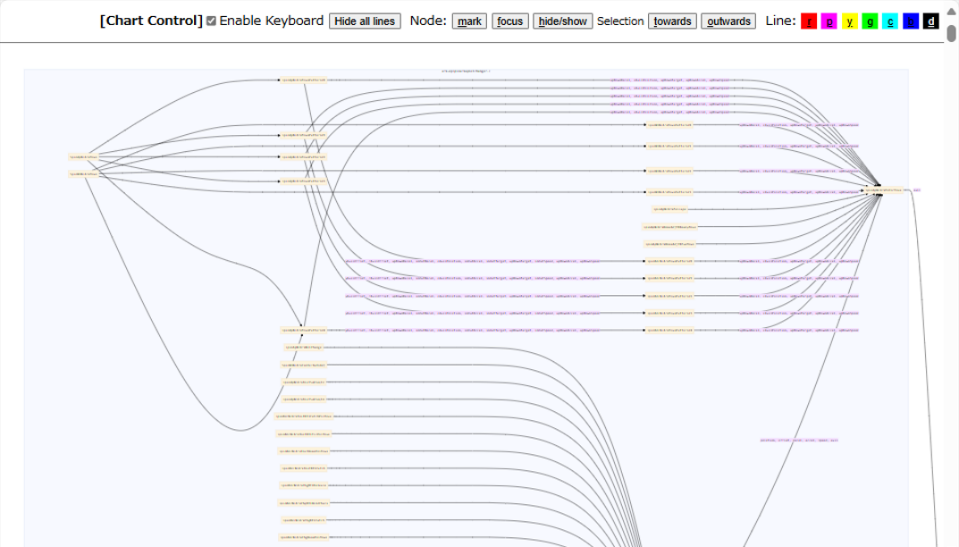

# vizCallmap
A tool for visualizing the function calls map

## Prerequisite

Build tree sitter library for code parsing.

```bash
$ cd modules/treesitter
$ git clone https://github.com/tree-sitter/tree-sitter-c
$ python build_ts_parser.py
```

## Usage

Run `main.py` in either python prompt windows or command line.

Output is html format like this in `data` folder.



## Todo

Current only support C language. Support more language support.